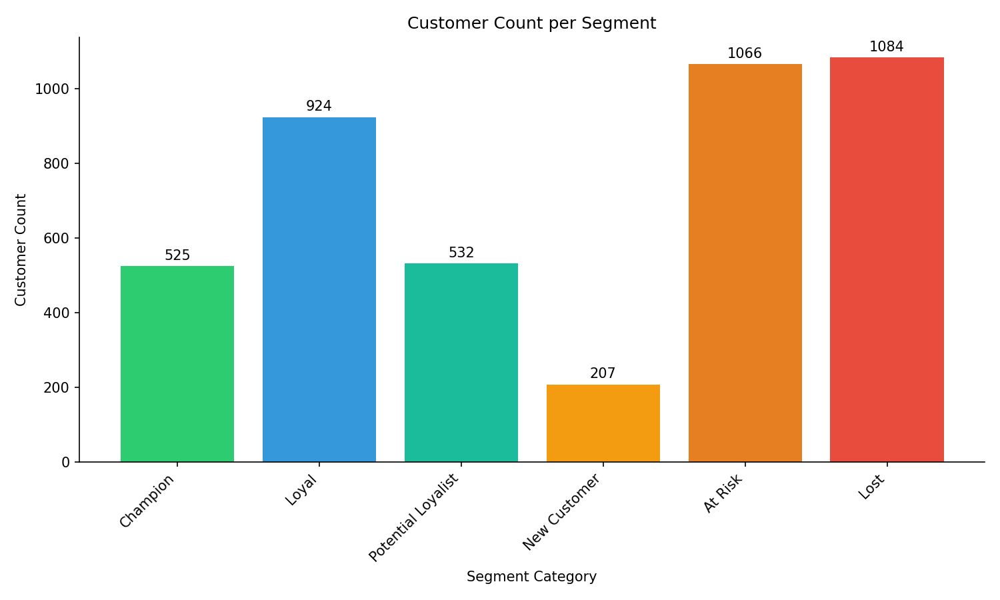
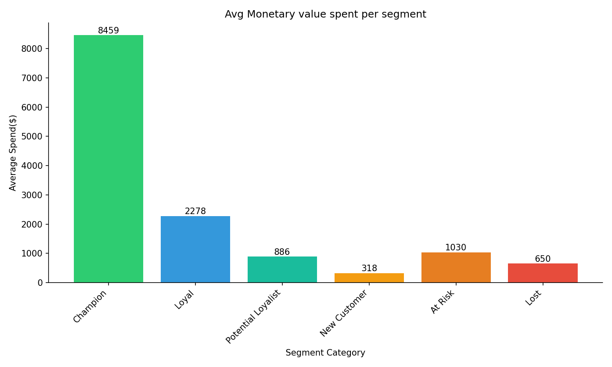
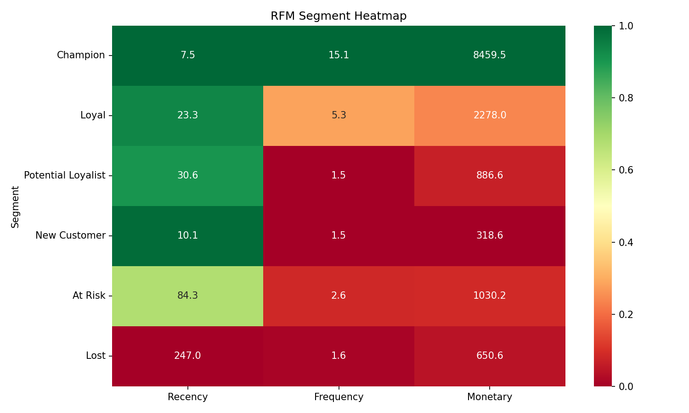

# Customer Segmentation — RFM Analysis

## Business Problem
Businesses often treat all customers the same, but not all customers are equal. 
This project segments customers based on their purchasing behaviour to identify 
who the most valuable customers are, who is at risk of churning, and who has 
already been lost — enabling more targeted and effective marketing decisions.

## Dataset
- **Source:** [UCI Online Retail Dataset via Kaggle](https://www.kaggle.com/datasets/lakshmi25npathi/online-retail-dataset)
- **Period:** December 2010 – December 2011
- **Records:** ~541,000 transactions
- **Region:** Primarily UK-based online retailer
- **Features:** InvoiceNo, StockCode, Description, Quantity, InvoiceDate, 
  UnitPrice, CustomerID, Country

## Methodology
1. Data cleaning and preprocessing
2. RFM feature engineering (Recency, Frequency, Monetary)
3. Customer scoring and segmentation
4. Segment analysis and business insights
5. Interactive dashboard (Power BI)

## Key Findings
The categories used were, in order of customer journey, Champion, Loyal, Potential Loyalist, New Customer, At Risk, and Lost. 

- The Lost segment was found to be the biggest segment (24.98%) of customers, closely followed by the At Risk segment (24.57%). This signals that the business is currently losing most of its customers and is unable to retain most of the new engagement that is generated by marketing. This issue must be addressed as it points to a fundamental problem in the business as the business is not stable and can not grow without retaining new customers.
- The main revenue segments are the Champion (12.1% of Customers) and Loyal (21.3% of Customers) segments. They generate 49.97% and 23.68% of total revenue respectively. There is also a significant portion of the revenue contributed by the At Risk segment of 12.35%. However, this is mainly due to the large number of customers in this segment and is actually a cause of concern. Around 30% of the customer base in providing approximately 70% of the company revenue. That means only the old, loyal, returning customers are spending any money, while newer customers are either leaving or spending money initially and losing interest after.

## Recommendations

- Based on the information found, the company must immediately prioritize re-engaging At Risk customers in order to get higher customer retention and better revenue flow. This can be done by launching campaigns to win back these customers either through targeted discount sales for products based on their purchase history. More customers can be retained by offering discounts on the next purchase to incentivize returning customers.
- The company must also prioritize their top customers, the Champion and Loyal segment customers. The company can launch programs like loyalty programs offering better discounts or giving them early access to new products. Other ideas include running surveys for potential products and accepting suggestions on changes for products. It is an absolute priority to convert loyal customers to champion customers as champion customers spend 3.7x more than loyal customers.

## Dashboard
*To be added*

## Visualisations




## Tools Used
- Python (Pandas, Matplotlib, Seaborn)
- Jupyter Notebook
- Power BI
- Git

## How to Run

1. Clone the repository
```bash
   git clone https://github.com/MArfanA333/customer-segmentation-rfm.git
```
2. Create and activate the conda environment
```bash
   conda create --name rfm-analysis python=3.11
   conda activate rfm-analysis
   pip install -r requirements.txt
```
3. Download the dataset from [Kaggle](https://www.kaggle.com/datasets/lakshmi25npathi/online-retail-dataset) 
   and place it in `data/raw/`
4. Run notebooks in order:
   - `01_data_exploration.ipynb`
   - `02_data_cleaning.ipynb`
   - `03_rfm_analysis.ipynb`
